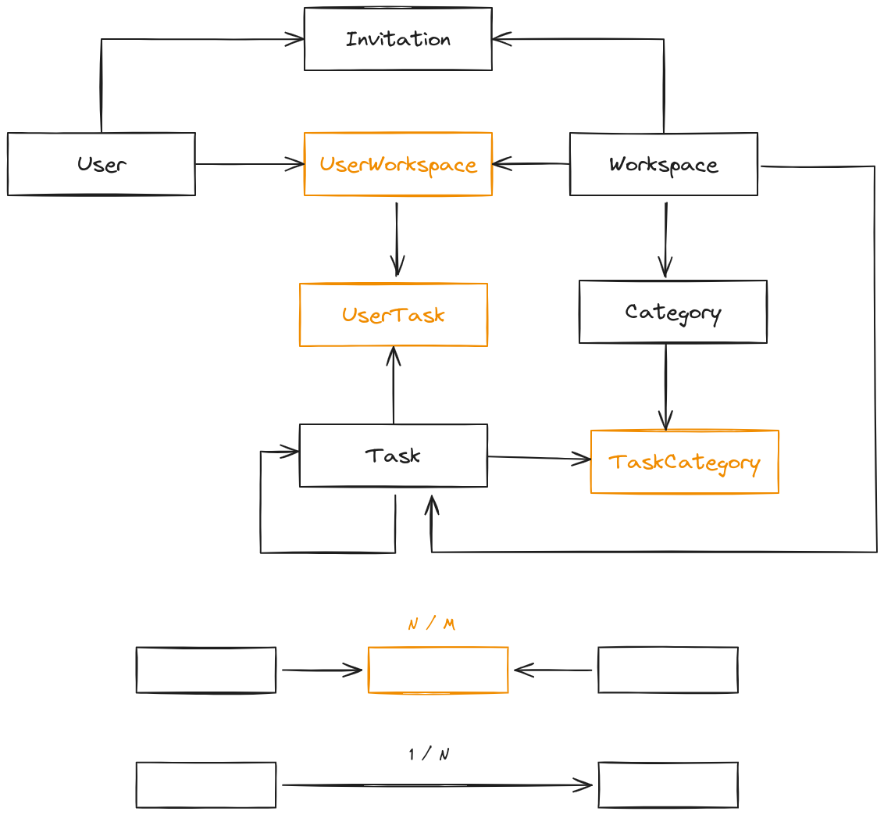
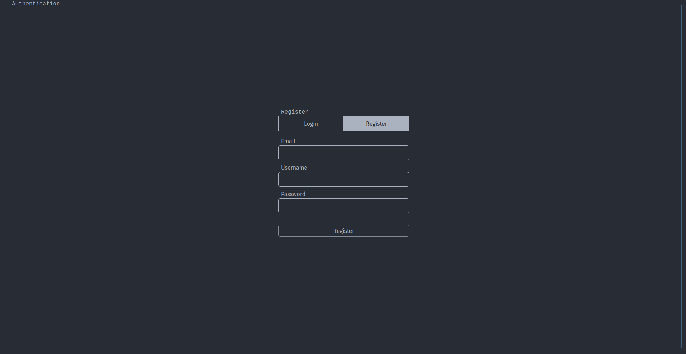
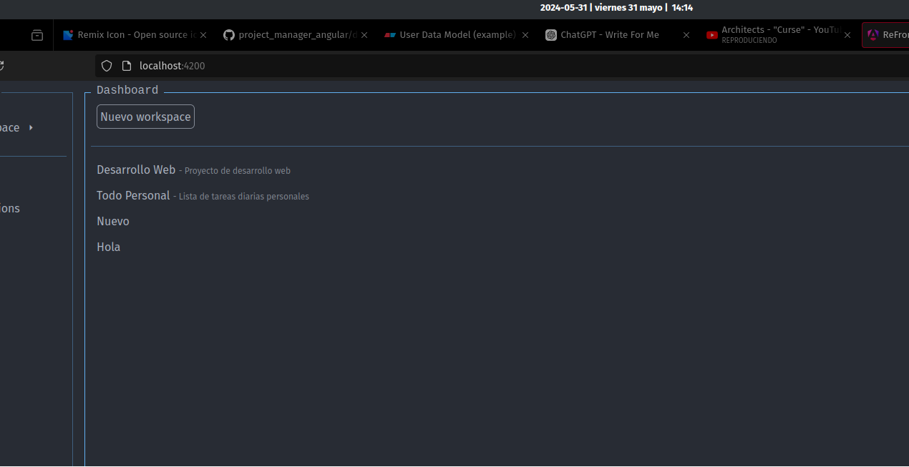

    <h1>WoTaaCa</h1>
    <h2>Workspace Tasks and Categories</h2>
    <h3>Proyecto de Fin de Ciclo</h3>
    <h4>Desarrollo de Aplicaciones Web</h4>
    <h5>2024</h5>
    
Realizado por: <strong>Sergio Fernández Fernández</strong>

## Indice General

- [Introducción](#introducción)
- [Palabras clave](#palabras-clave)
- [Indice General](#indice-general)
- [Objetivos](#objetivos)
- [Justificación](#justificación)
- [Descripción del proyecto](#descripción-del-proyecto)
- [Modulos formativos aplicados](#modulos-formativos-aplicados)
- [Herramientas/Lenguajes utilizados](#herramientaslenguajes-utilizados)
- [Fases del proyecto](#fases-del-proyecto)
- [Conclusiones y mejoras](#conclusiones-y-mejoras)
- [Anexos](#anexos)
- [Bibliografía](#bibliografía)

## Introducción

---

WoTaaCa es un software diseñado para ayudar a los usuarios a organizar sus tareas de manera flexible y sin imponer una metodología específica. En lugar de seguir un enfoque rígido, WoTaaCa permite a cada usuario estructurar sus actividades según sus propias preferencias.

En un workspace, los usuarios pueden crear tareas, asignar relaciones entre ellas y establecer categorías para una mejor organización. Además, es posible invitar a otros usuarios al workspace, facilitando la colaboración en equipo.

## Palabras clave

---

- Workspace: Un workspace es un espacio aislado en el que los usuarios pueden organizar un conjunto específico de tareas y categorías.
- Tarea: Una tarea es una actividad que el usuario debe realizar, puede ser una tarea simple o una tarea compuesta por subtareas.

- Categoría: Una categoría permite a los usuarios organizar sus tareas y subtareas en grupos, por ejemplo, trabajo, estudio, personal, etc.
  No esta opinionada por lo que tambien puede representar prioridades, o estados de las tareas.
- Prioridad: La prioridad de una tarea indica la importancia de la tarea, puede ser baja, media, alta o critica
- Angular: Angular es un framework de desarrollo de aplicaciones web desarrollado por Google.
- NodeJS: NodeJS es un entorno de ejecución de JavaScript que permite a los desarrolladores crear aplicaciones de servidor.
- Express: Express es un framework de desarrollo de aplicaciones web para NodJS.
- Typescript: Typescript es un lenguaje de programación que extiende JavaScript con características de programación orientada a objetos.
- Docker: Docker es una plataforma de software que permite a los desarrolladores crear, probar y desplegar aplicaciones de forma rápida y eficiente.
- mysql: Mysql es un sistema de gestión de bases de datos relacional.
- TailwindCSS: TailwindCSS es un framework de diseño de sitios web que permite a los desarrolladores crear sitios web con un diseño moderno y atractivo.

## Objetivos

---

Como objetivos he buscado:

- He buscado desarrollar una aplicación que me permita organizar mis tareas, primero de forma no opinionada es decir:
  - No se base en una metodologia en concreto, sino que poder organizar las tareas en función del deseo del usuario.
- Permitir agregar tags que permitan organizar las tareas estos han de ser personalizables en función de las necesidades del usuario, algunos ejemplos:
  - [Bug, Feature, Improvement, etc]
  - [Pendiente, En progreso, Completado, etc]
- Permitir la colaboración dentro de un workspace:
  - Invitar a otros usuarios.
  - Asignación de tareas.
  - Comentarios en las tareas. (No implementado)
- Organizar las tareas ha de ser sencillo y rápido.
  - Todas las tareas pueden ser modificadas en cualquier momento.
  - Ocultar campos que no se usen. (No implementado)
  - Permitir el filtrado de tareas en función de los tags.
  - Permitir añadido de subtareas a las tareas.

## Justificación

---

A lo largo del tiempo he usado diferentes aplicaciones para organizar mis tareas, y he encontrado que la mayoría de ellas son demasiado complicadas o no se adaptan a mis necesidades.
Por eso, he decidido desarrollar mi propia aplicación que me permita organizar mis tareas de forma eficiente y efectiva.

## Modulos formativos aplicados

### Desarrollo de aplicaciones web en entorno cliente

Del módulo de desarrollo de aplicaciones web en entorno cliente, se han aprovechado los siguientes conceptos:

- Uso del framework Angular para el desarrollo.

### Desarrollo de aplicaciones web en entorno servidor

Del módulo de desarrollo de aplicaciones web en entorno servidor, saco los siguientes conceptos aplicados:

- Uso de la arquitectura api rest.
- Implementación de controladores y modelos, para la gestión separada de la lógica de negocio y la gestión de la base de datos.

### Diseño de interfaces web

Durante el módulo de diseño de interfaces web, se han aprendido los conceptos de diseño de interfaces de usuario, usabilidad y accesibilidad, que se han aplicado en el diseño de la aplicación.

## Herramientas/Lenguajes utilizados

### Herramientas de desarrollo

- **NeoVim**
  - He Decidido usar NeoVim, por su personalización que me ha permitido adaptarlo a mi gusto, otro de los motivos es que es de codigo abierto una mentalidad que comparto, ademas de ser muy rapido y ligero.
- **Docker**
  - He utilizado docker para el despliegue de una base de datos mysql.
- **Git**
  - Git ha sido usado para manejar las versiones del proyecto, permitiendo navegar entre una rama de testeo, desarrollo y producción, lo que ha facilitado el desarrollo del proyecto.
- **Github**
  - Github me ha permitido alojar los ficheros del proyecto, y asi poder compartirlo entre diferentes equipos.

### FrontEnd

- **Angular**
  - La elección de angular radica en:
    - Su estudio en desarrollo de aplicaciones web en entorno cliente.
    - La facilidad que tiene a la hora escalar proyectos.
  - Sin duda angular ha sido una parte clave durante el desarrollo del proyecto, el uso de servicios ha permitido mantener un scope global de los datos, con lo que distintas partes de la aplicación pueden acceder a los datos de forma mas sencilla.
- **TailwindCSS**
  - La elección de tailwindcss para la aplicación de estilos tiene que ver con:
    - Su facilidad de uso, con la que el desarrollo puede ocurrir de forma mas rápida sin tener que entreterse entre ficheros css o ser demasiodo repetitivo.
    - La compatibilidad con angular, que permite su uso sin problema.

### BackEnd

- **NodeJS**
  - NodeJS ha sido la elección para el desarrollo del backend por:
    - El rapido acercamiento que permite el framework, gracias a su uso de javascript no ha sido necesario aprender un nuevo lenguaje.
- **Typescript**
  - Typescript ha ofrecido una ayuda inestimable a la hora de desarrollar gracias al tipado, detectar errores durante el desarrollo.

### BBDD

- **Mysql**
  - MySql es una base de datos rapida y fiable, ha permitido almacenar y acceder a los datos de forma eficiente.

## Fases del proyecto

### Estudio de mercado

En esta fase se ha realizado un estudio de mercado para identificar las necesidades de los usuarios y las características de las aplicaciones de gestión de tareas existentes. Se ha analizado la competencia y se han identificado las fortalezas y debilidades de las aplicaciones existentes.

#### Debilidades de las aplicaciones existentes

- Complejidad: Muchas aplicaciones de gestión de tareas son demasiado complejas y ofrecen más funciones de las necesarias, lo que puede resultar abrumador para los usuarios.
- Rigidez: Algunas aplicaciones están basadas en metodologías específicas, lo que limita la flexibilidad y la adaptabilidad a las necesidades de los usuarios.
- Colaboración: La colaboración entre usuarios puede ser limitada o poco intuitiva en algunas aplicaciones, lo que dificulta la comunicación y la coordinación entre los miembros del equipo.

#### Fortalezas de las aplicaciones existentes

- Funcionalidades avanzadas: Algunas aplicaciones ofrecen funciones avanzadas como seguimiento del tiempo, integración con calendarios, etc.
- Diseño atractivo: Muchas aplicaciones tienen un diseño moderno y atractivo que mejora la experiencia del usuario.
- Integración con otras herramientas: Algunas aplicaciones se integran con otras herramientas como Slack, Google Drive, etc., lo que facilita la gestión de tareas y la colaboración.

#### Extrapolar las necesidades de los usuarios

Se ha considerado que los usuarios buscan una aplicación de gestión de tareas que sea sencilla, flexible y eficiente.
Los usuarios desean una aplicación que les permita organizar sus tareas de forma personalizada, sin imponer una metodología específica. Además, los usuarios valoran la colaboración y la comunicación entre miembros del equipo, por lo que es importante que la aplicación facilite la colaboración y la asignación de tareas.

### Modelo de datos

#### Diagrama Base de Datos

La base de datos esta compuesta por siete tablas,
5 tablas principales y 3 tablas de relación.

#### Entidades

##### User

La entidad User esta destinada a almacenar los datos puros de un usuario.

| Field     | Type         | null | Key | Default | Extra          |
| --------- | ------------ | ---- | --- | ------- | -------------- |
| id        | int(11)      | NO   | PRI | NULL    | auto_increment |
| username  | varchar(255) | NO   |     | NULL    |                |
| email     | varchar(255) | NO   |     | NULL    |                |
| password  | varchar(255) | NO   |     | NULL    |                |
| createdAt | datetime     | NO   |     | NULL    |                |
| settings  | longtext     | YES  |     | NULL    |                |
| deleted   | tinyint      | NO   |     | 0       |                |

##### Workspace

La entidad Workspace almacena los datos de los workspace creados por los usuarios.

| Field       | Type         | Null | Key | Default | Extra          |
| ----------- | ------------ | ---- | --- | ------- | -------------- |
| id          | int(11)      | NO   | PRI | NULL    | auto_increment |
| name        | varchar(50)  | NO   |     | NULL    |                |
| description | varchar(255) | YES  |     | NULL    |                |
| createdAt   | datetime     | NO   |     | NULL    |                |
| deleted     | tinyint(1)   | NO   |     | 0       |                |

##### UserWorkspace

La entidad UserWorkspace almacena la relación entre un usuario y un workspace, determinando la propiedad y permisos del usuario sobre el workspace.

| Field       | Type                                   | Null | Key | Default | Extra          |
| ----------- | -------------------------------------- | ---- | --- | ------- | -------------- |
| id          | int(11)                                | NO   | PRI | NULL    | auto_increment |
| idUser      | int(11)                                | NO   | MUL | NULL    |                |
| idWorkspace | int(11)                                | NO   | MUL | NULL    |                |
| role        | enum('ADMIN', 'MEMBER', 'GUEST') | NO   |     | GUEST   |                |
| deleted     | tinyint(1)                             | NO   |     | NULL    |                |

##### Invitation

La entidad Invitation consiste en los registros de invitaciones enviadas a un usuario para unirse a un workspace.

| Field       | Type         | Null | Key | Default | Extra          |
| ----------- | ------------ | ---- | --- | ------- | -------------- |
| id          | int(11)      | NO   | PRI | NULL    | auto_increment |
| email       | varchar(100) | NO   |     | NULL    |                |
| idWorkspace | int(11)      | NO   | MUL | NULL    |                |
| createdAt   | datetime     | NO   |     | NULL    |                |
| deleted     | tinyint(1)   | NO   |     | 0       |                |

##### Task

La entidad Task almacena los datos de las tareas creadas por los usuarios dentro de un workspaace.

| Field           | Type                                                          | Null | Key | Default | Extra          |
| --------------- | ------------------------------------------------------------- | ---- | --- | ------- | -------------- |
| id              | int(11)                                                       | NO   | PRI | NULL    | auto_increment |
| name            | varchar(50)                                                   | NO   |     | NULL    |                |
| description     | varchar(255)                                                  | YES  |     | NULL    |                |
| createdAt       | datetime                                                      | NO   |     | NULL    |                |
| idWorkspace     | int(11)                                                       | NO   | MUL | NULL    |                |
| visibility      | enum('PUBLIC', 'PRIVATE')                                  | NO   |     | PRIVATE |                |
| deadline        | datetime                                                      | YES  |     | NULL    |                |
| completed       | tinyint(1)                                                    | NO   |     | 0       |                |
| priority        | enum('NONE', 'LOW', 'MEDIUM', 'HIGH', 'CRITICAL') | NO   |     | NONE    |                |
| dependentIdTask | int(11)                                                       | YES  | MUL | NULL    |                |
| deleted         | tinyint(1)                                                    | NO   |     | 0       |                |

##### Category

La entidad Category almacena los datos de las categorías creadas por los usuarios dentro de un workspace, que permiten dar matices a las tareas.

| Field       | Type         | Null | Key | Default | Extra          |
| ----------- | ------------ | ---- | --- | ------- | -------------- |
| id          | int(11)      | NO   | PRI | NULL    | auto_increment |
| name        | varchar(50)  | NO   |     | NULL    |                |
| description | varchar(255) | YES  |     | NULL    |                |
| idWorkspace | int(11)      | NO   | MUL | NULL    |                |
| color       | varchar(7)   | YES  |     | NULL    |                |
| completed   | tinyint(1)   | NO   |     | 0       |                |
| deleted     | tinyint(1)   | NO   |     | 0       |                |

##### TaskCategory

La entidad TaskCategory almacena la relación entre una tarea y una categoría.

| Field      | Type    | Null | Key | Default | Extra          |
| ---------- | ------- | ---- | --- | ------- | -------------- |
| id         | int(11) | NO   | PRI | NULL    | auto_increment |
| idTask     | int(11) | NO   | MUL | NULL    |                |
| idCategory | int(11) | NO   | MUL | NULL    |                |

##### UserTask

La entidad UserTask almacena la relación entre un usuario y una tarea, determinando la propiedad y permisos del usuario sobre la tarea.

| Field  | Type                           | Null | Key | Default | Extra          |
| ------ | ------------------------------ | ---- | --- | ------- | -------------- |
| id     | int(11)                        | NO   | PRI | NULL    | auto_increment |
| idUser | int(11)                        | NO   | MUL | NULL    |                |
| idTask | int(11)                        | NO   | MUL | NULL    |                |
| role   | enum('ADMIN','MEMBER','GUEST') | NO   |     | GUEST   |                |

### Diseño de la aplicación

#### Estilos visual

Para el estilo visual se ha buscado un diseño tipo TUI o Terminal User Interface, el cual se caracteriza por su estética simple y funcional. En este diseño, se destacan el uso de colores planos y tipografías monoespaciadas, creando un aspecto retro y nostálgico que rememora las antiguas interfaces de terminal.

El uso de fuentes monoespaciadas no solo contribuye a la apariencia vintage del diseño, sino que también ofrece ventajas prácticas, como la alineación perfecta de caracteres, lo cual es esencial en entornos de programación y desarrollo. Estas fuentes monoespaciadas se han aprovechado especialmente en los títulos de las secciones, dando un toque distintivo y coherente a la interfaz.

Además, la elección de colores planos simplifica el diseño, eliminando distracciones visuales y permitiendo que el contenido sea el protagonista. Esta simplicidad cromática es fundamental para mantener la claridad y legibilidad, aspectos cruciales en una interfaz de usuario terminal.

En resumen, el diseño TUI combina funcionalidad y estilo, haciendo uso de elementos visuales que no solo mejoran la estética, sino que también optimizan la experiencia del usuario. Este enfoque minimalista pero efectivo convierte a las interfaces de usuario de terminal en una opción atractiva para desarrolladores y usuarios que valoran la eficiencia y la simplicidad.

##### Paleta de colores

La paleta de colores se ha visto influenciada por el tema One Dark, un esquema de colores creado para el editor de codigo atom, que se caracteriza por una combinación de tonos oscuros y colores vibrantes.

##### Tipografía

Para la tipografía he decidido usar la fuente Inter por su legibilidad y su aspecto moderno. La fuente Inter es conocida por su claridad y su diseño optimizado para la lectura en pantallas, lo que la convierte en una elección ideal para la interfaz de usuario. Su aspecto limpio y contemporáneo contribuye a una experiencia de usuario agradable y eficiente.

Por otro lado, los títulos aprovechan la fuente Fira Code por su aspecto monoespaciado. Fira Code no solo ofrece la alineación perfecta de caracteres, esencial en entornos de programación y desarrollo, sino que también incluye ligaduras de programación que mejoran la legibilidad del código. Estas caracerísticas hacen que Fira Code sea una opción excelente para los títulos, proporcionando un contraste visual interesante y manteniendo la coherencia estilística con el diseño TUI.

#### Wireframes

##### Aside

##### Task Section

##### Header

##### Modal Forms

#### Iconos

Para los iconos se ha usado la libreria Remix Icon, que ofrece una amplia variedad de iconos modernos y estilizados que se adaptan perfectamente al diseño TUI. Estos iconos no solo añaden un toque visual atractivo, sino que también mejoran la usabilidad y la accesibilidad de la interfaz, facilitando la identificación de las funciones y elementos de la aplicación. 
<svg xmlns="http://www.w3.org/2000/svg" viewBox="0 0 24 24" width="24" height="24" fill="currentColor"><path d="M10 18H14V16H10V18ZM3 6V8H21V6H3ZM6 13H18V11H6V13Z"></path></svg>
<svg xmlns="http://www.w3.org/2000/svg" viewBox="0 0 24 24" width="24" height="24" fill="currentColor"><path d="M12 1L21.5 6.5V17.5L12 23L2.5 17.5V6.5L12 1ZM4.5 7.65311V7.65788L12 12V20.689L19.5 16.3469V7.65311L12 3.311L4.5 7.65311Z"></path></svg>
<svg xmlns="http://www.w3.org/2000/svg" viewBox="0 0 24 24" width="24" height="24" fill="currentColor"><path d="M21 20C21 20.5523 20.5523 21 20 21H4C3.44772 21 3 20.5523 3 20V9.48907C3 9.18048 3.14247 8.88917 3.38606 8.69972L11.3861 2.47749C11.7472 2.19663 12.2528 2.19663 12.6139 2.47749L20.6139 8.69972C20.8575 8.88917 21 9.18048 21 9.48907V20ZM19 19V9.97815L12 4.53371L5 9.97815V19H19Z"></path></svg>
<svg xmlns="http://www.w3.org/2000/svg" viewBox="0 0 24 24" width="24" height="24" fill="currentColor"><path d="M3 3H21C21.5523 3 22 3.44772 22 4V20C22 20.5523 21.5523 21 21 21H3C2.44772 21 2 20.5523 2 20V4C2 3.44772 2.44772 3 3 3ZM20 7.23792L12.0718 14.338L4 7.21594V19H20V7.23792ZM4.51146 5L12.0619 11.662L19.501 5H4.51146Z"></path></svg>
<svg xmlns="http://www.w3.org/2000/svg" viewBox="0 0 24 24" width="24" height="24" fill="currentColor"><path d="M4 22C4 17.5817 7.58172 14 12 14C16.4183 14 20 17.5817 20 22H18C18 18.6863 15.3137 16 12 16C8.68629 16 6 18.6863 6 22H4ZM12 13C8.685 13 6 10.315 6 7C6 3.685 8.685 1 12 1C15.315 1 18 3.685 18 7C18 10.315 15.315 13 12 13ZM12 11C14.21 11 16 9.21 16 7C16 4.79 14.21 3 12 3C9.79 3 8 4.79 8 7C8 9.21 9.79 11 12 11Z"></path></svg>
<svg xmlns="http://www.w3.org/2000/svg" viewBox="0 0 24 24" width="24" height="24" fill="currentColor"><path d="M4 18H6V20H18V4H6V6H4V3C4 2.44772 4.44772 2 5 2H19C19.5523 2 20 2.44772 20 3V21C20 21.5523 19.5523 22 19 22H5C4.44772 22 4 21.5523 4 21V18ZM6 11H13V13H6V16L1 12L6 8V11Z"></path></svg>
<svg xmlns="http://www.w3.org/2000/svg" viewBox="0 0 24 24" width="24" height="24" fill="currentColor"><path d="M12.0005 3C16.2849 3 20.2196 4.49683 23.3104 6.99607L12.0005 21L0.689941 6.99671C3.78078 4.49709 7.71583 3 12.0005 3ZM12.0005 5C8.97296 5 6.07788 5.84185 3.57997 7.39179L12.0005 17.8169L20.4204 7.39132C17.9226 5.84167 15.0278 5 12.0005 5Z"></path></svg>
<svg xmlns="http://www.w3.org/2000/svg" viewBox="0 0 24 24" width="24" height="24" fill="currentColor"><path d="M12.0005 3C16.2849 3 20.2196 4.49683 23.3104 6.99607L12.0005 21L0.689941 6.99671C3.78078 4.49709 7.71583 3 12.0005 3ZM12.0005 5C8.97296 5 6.07788 5.84185 3.57997 7.39179L8.68885 13.7155C9.69799 13.256 10.8194 13 12.0005 13C13.1818 13 14.3032 13.256 15.3123 13.7155L20.4204 7.39132C17.9226 5.84167 15.0278 5 12.0005 5Z"></path></svg>
<svg xmlns="http://www.w3.org/2000/svg" viewBox="0 0 24 24" width="24" height="24" fill="currentColor"><path d="M12.0005 3C16.2849 3 20.2196 4.49683 23.3104 6.99607L12.0005 21L0.689941 6.99671C3.78078 4.49709 7.71583 3 12.0005 3ZM12.0005 5C8.97296 5 6.07788 5.84185 3.57997 7.39179L6.75851 11.327C8.31685 10.4807 10.1026 10 12.0005 10C13.8983 10 15.6838 10.4806 17.242 11.3267L20.4204 7.39132C17.9226 5.84167 15.0278 5 12.0005 5Z"></path></svg>
<svg xmlns="http://www.w3.org/2000/svg" viewBox="0 0 24 24" width="24" height="24" fill="currentColor"><path d="M12.0005 3C16.2849 3 20.2196 4.49683 23.3104 6.99607L12.0005 21L0.689941 6.99671C3.78078 4.49709 7.71583 3 12.0005 3Z"></path></svg>
<svg xmlns="http://www.w3.org/2000/svg" viewBox="0 0 24 24" width="24" height="24" fill="currentColor"><path d="M12.8659 3.00017L22.3922 19.5002C22.6684 19.9785 22.5045 20.5901 22.0262 20.8662C21.8742 20.954 21.7017 21.0002 21.5262 21.0002H2.47363C1.92135 21.0002 1.47363 20.5525 1.47363 20.0002C1.47363 19.8246 1.51984 19.6522 1.60761 19.5002L11.1339 3.00017C11.41 2.52187 12.0216 2.358 12.4999 2.63414C12.6519 2.72191 12.7782 2.84815 12.8659 3.00017ZM4.20568 19.0002H19.7941L11.9999 5.50017L4.20568 19.0002ZM10.9999 16.0002H12.9999V18.0002H10.9999V16.0002ZM10.9999 9.00017H12.9999V14.0002H10.9999V9.00017Z"></path></svg>
<svg xmlns="http://www.w3.org/2000/svg" viewBox="0 0 24 24" width="24" height="24" fill="currentColor"><path d="M3 4H21V6H3V4ZM3 11H21V13H3V11ZM3 18H21V20H3V18Z"></path></svg>
<svg xmlns="http://www.w3.org/2000/svg" viewBox="0 0 24 24" width="24" height="24" fill="currentColor"><path d="M17 6H22V8H20V21C20 21.5523 19.5523 22 19 22H5C4.44772 22 4 21.5523 4 21V8H2V6H7V3C7 2.44772 7.44772 2 8 2H16C16.5523 2 17 2.44772 17 3V6ZM18 8H6V20H18V8ZM13.4142 13.9997L15.182 15.7675L13.7678 17.1817L12 15.4139L10.2322 17.1817L8.81802 15.7675L10.5858 13.9997L8.81802 12.232L10.2322 10.8178L12 12.5855L13.7678 10.8178L15.182 12.232L13.4142 13.9997ZM9 4V6H15V4H9Z"></path></svg>
<svg xmlns="http://www.w3.org/2000/svg" viewBox="0 0 24 24" width="24" height="24" fill="currentColor"><path d="M12.4142 5H21C21.5523 5 22 5.44772 22 6V20C22 20.5523 21.5523 21 21 21H3C2.44772 21 2 20.5523 2 20V4C2 3.44772 2.44772 3 3 3H10.4142L12.4142 5ZM4 5V19H20V7H11.5858L9.58579 5H4ZM11 15H13V17H11V15ZM11 9H13V14H11V9Z"></path></svg>
<svg xmlns="http://www.w3.org/2000/svg" viewBox="0 0 24 24" width="24" height="24" fill="currentColor"><path d="M13.0607 8.11097L14.4749 9.52518C17.2086 12.2589 17.2086 16.691 14.4749 19.4247L14.1214 19.7782C11.3877 22.5119 6.95555 22.5119 4.22188 19.7782C1.48821 17.0446 1.48821 12.6124 4.22188 9.87874L5.6361 11.293C3.68348 13.2456 3.68348 16.4114 5.6361 18.364C7.58872 20.3166 10.7545 20.3166 12.7072 18.364L13.0607 18.0105C15.0133 16.0578 15.0133 12.892 13.0607 10.9394L11.6465 9.52518L13.0607 8.11097ZM19.7782 14.1214L18.364 12.7072C20.3166 10.7545 20.3166 7.58872 18.364 5.6361C16.4114 3.68348 13.2456 3.68348 11.293 5.6361L10.9394 5.98965C8.98678 7.94227 8.98678 11.1081 10.9394 13.0607L12.3536 14.4749L10.9394 15.8891L9.52518 14.4749C6.79151 11.7413 6.79151 7.30911 9.52518 4.57544L9.87874 4.22188C12.6124 1.48821 17.0446 1.48821 19.7782 4.22188C22.5119 6.95555 22.5119 11.3877 19.7782 14.1214Z"></path></svg>
<svg xmlns="http://www.w3.org/2000/svg" viewBox="0 0 24 24" width="24" height="24" fill="currentColor"><path d="M9 1V3H15V1H17V3H21C21.5523 3 22 3.44772 22 4V20C22 20.5523 21.5523 21 21 21H3C2.44772 21 2 20.5523 2 20V4C2 3.44772 2.44772 3 3 3H7V1H9ZM20 11H4V19H20V11ZM8 13V15H6V13H8ZM13 13V15H11V13H13ZM18 13V15H16V13H18ZM7 5H4V9H20V5H17V7H15V5H9V7H7V5Z"></path></svg>
<svg xmlns="http://www.w3.org/2000/svg" viewBox="0 0 24 24" width="24" height="24" fill="currentColor"><path d="M4 3H20C20.5523 3 21 3.44772 21 4V20C21 20.5523 20.5523 21 20 21H4C3.44772 21 3 20.5523 3 20V4C3 3.44772 3.44772 3 4 3ZM5 5V19H19V5H5Z"></path></svg>
<svg xmlns="http://www.w3.org/2000/svg" viewBox="0 0 24 24" width="24" height="24" fill="currentColor"><path d="M4 3H20C20.5523 3 21 3.44772 21 4V20C21 20.5523 20.5523 21 20 21H4C3.44772 21 3 20.5523 3 20V4C3 3.44772 3.44772 3 4 3ZM5 5V19H19V5H5ZM11.0026 16L6.75999 11.7574L8.17421 10.3431L11.0026 13.1716L16.6595 7.51472L18.0737 8.92893L11.0026 16Z"></path></svg>
<svg xmlns="http://www.w3.org/2000/svg" viewBox="0 0 24 24" width="24" height="24" fill="currentColor"><path d="M6.41421 15.89L16.5563 5.74785L15.1421 4.33363L5 14.4758V15.89H6.41421ZM7.24264 17.89H3V13.6473L14.435 2.21231C14.8256 1.82179 15.4587 1.82179 15.8492 2.21231L18.6777 5.04074C19.0682 5.43126 19.0682 6.06443 18.6777 6.45495L7.24264 17.89ZM3 19.89H21V21.89H3V19.89Z"></path></svg>
<svg xmlns="http://www.w3.org/2000/svg" viewBox="0 0 24 24" width="24" height="24" fill="currentColor"><path d="M11 11V5H13V11H19V13H13V19H11V13H5V11H11Z"></path></svg>
<svg xmlns="http://www.w3.org/2000/svg" viewBox="0 0 24 24" width="24" height="24" fill="currentColor"><path d="M19 11H5V13H19V11Z"></path></svg>

### Diagramas de flujo

#### Flujo de Solicitud y modificación de datos

A la hora de manejar los datos de la aplicación, se ha seguido una arquitectura que permite primero la modificación de los datos en el cliente, para posteriormente pedir una actualización de los datos en el servidor.
El servidor confirmara o denegara la actualización de estos datos, y en función de la respuesta se actualizaran los datos en el cliente.

Esto nos permite una mayor responsividad en la aplicación, ya que los datos se actualizan de forma inmediata y no es necesario pasar por ninguna recarga de la página.

Este flujo de datos se utiliza para todas las operaciones de la apliación desde la creación de una tarea, hasta la eliminación de un workspace.

Los datos se almacenan en la base de datos, el servidor devuelve los datos al cliente que lo almacena en un servicio en forma de observable, al cual se suscriben los distintos componentes de la aplicación. Permitiendoles acceder a los datos actualizados en tiempo real.

#### Flujo de autenticación

El flujo de autenticación se basa en el uso de tokens JWT, que permiten la autenticación de los usuarios en la aplicación. Cuando un usuario se registra o inicia sesión, se genera un token JWT que se almacena en el cliente y se envía en las cabeceras de las peticiones al servidor. El servidor verifica la validez del token y permite el acceso a las rutas protegidas si el token es válido.

Este metodo aunque seguro, no es infalible, ya que un atacante podria robar el token y hacerse pasar por el usuario implementar un sistema de refresco de tokens, permitiria mejorar la seguridad de la aplicación.

## Conclusiones y mejoras

---

En conclusión, el proyecto PALET es un planificador de tareas que permite a los usuarios organizar sus actividades de forma no opinionada y eficiente.

Futuras mejoras:

- Sistema de asignación multiple de usuarios asinados a una tarea.
- Reformar la pestaña de invitaciones para convertirla en una pestaña de notificaciones, completa con indicaciones varias.
- Implementar un sistema de que notifique al usuario cuando una tarea está próxima a vencer.
- Notificar al usuario cuando una tarea le ha sido asignada por otro usuario.
- Implementar pagina de estadisticas de workspace, con graficos indicando el progreso de las tareas, que usuarios han completado mas tareas, etc.
- Sistema de comentarios en las tareas, esto permitiria a los usuarios comunicarse de forma mas eficiente.
- Mejorar el sistema de refresco de tokens, para mejorar la seguridad de la aplicación.
- Mejorar el actual sistema de refresco de datos, para que los datos se actualicen de forma mas eficiente.

## Anexos

---

### Instalación de dependencias

1. Acceder a la carpeta mysql y ejecutar el comando `docker compose up`
2. Acceder a la carpeta backend y ejecutar el comando `npm install`
3. Acceder a la carpeta frontend y ejecutar el comando `npm install`

### Ejecución del proyecto

Hay que ejecutar tres modulos

1. Acceder a la carpeta backend y ejecutar el comando `npm run dev` o `node --run dev`
2. Acceder a la carpeta frontend y ejecutar el comando `ng serve`

Si se ha finalizado la ejecución del docker de mysql. 3. Acceder a la carpeta mysql y ejecutar el comando `docker compose start`

### Acceso a la aplicación

Acceder a la dirección `http://localhost:4200` para acceder a la aplicación.

### Acceso a la base de datos

Para acceder a la base de datos, se puede usar cualquier cliente de mysql, como por ejemplo `MySQL Workbench` o `DBeaver`.

Tambien se puede acceder a la base de datos en `http://localhost:8080` con las siguientes credenciales:

- Usuario: root
- Contraseña: rootpassdev

### Imagenes de la aplicación

#### Login

#### Register

#### Workspaces

#### Tasks

#### Users

#### Categories

#### Options

#### Invitations

#### Submenus

#### Task Form

#### Filters

## Bibliografía

---

- [Angular](https://angular.dev/)
- [TailwindCSS](https://tailwindcss.com/)
- [NodeJS](https://nodejs.org/)
- [Express](https://expressjs.com/)
- [Typescript](https://www.typescriptlang.org/)
